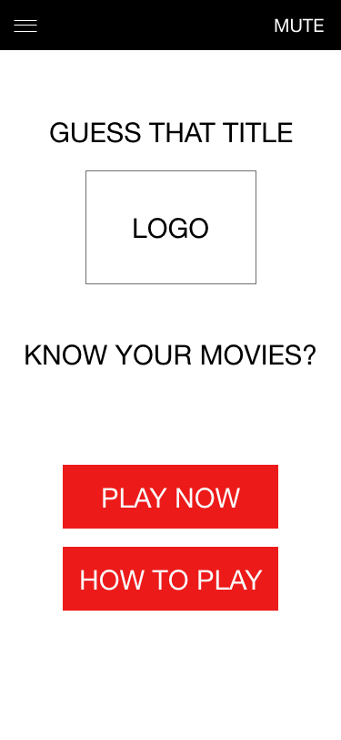
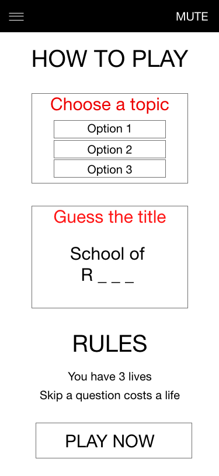
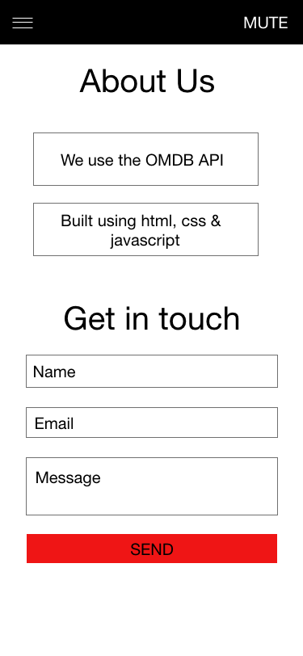
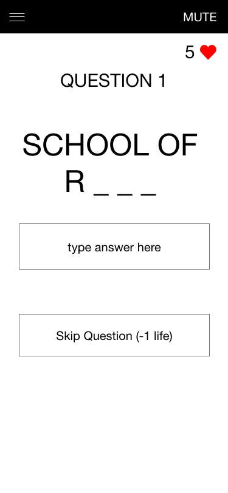
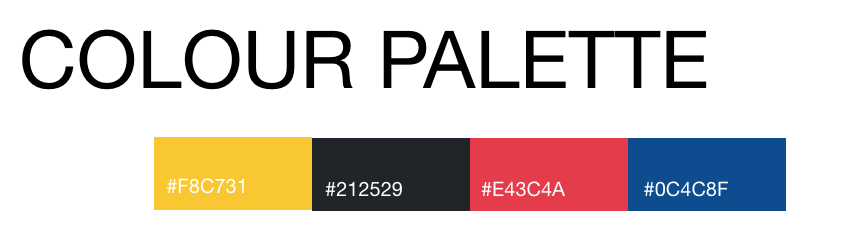

<h1 align="center">
Interactive Frontend - Milestone Project 2 - Guess That Title - David O Neill
</h1>

<h1 align="center"> 

</h1>

<h2 align="center">About The Game</h2>

Guess That Title is an fun, interactive quiz game that's all about guessing! You will be presented with topics to choose from. Based on your choice, 
you will be given movie titles with one word missing! Your task is to guess the missing word before you run out of time! Round One is easy - you get 60 seconds! But each round, your
time is cut in half. How many rounds can you complete before you run out of lives?

<h4 align="center">Try Out Guess That Title <a href="https://davidosongschool.github.io/GuessThatTitle/">HERE</a></h4>

## Contents

1. [**UX**](#ux)
   - [**Strategy**](#strategy)
   - [**Scope**](#scope)
   - [**Structure**](#structure)
   - [**Design**](#design)
   - [**Surface**](#surface)

2. [**Features**](#features)
    - [**Features Implemented**](#Features-Implemented)
    - [**Possible Future Features**](#Futures-Features)

3. [**Technologies Used**](#technologies-used)
    - [**Languages Used**](#Languages-Used)
    - [**Libraries Used**](#Libraries-Used)

4. [**Testing**](#testing)

## UX

### [**Strategy**](#strategy)

In this section, we need to develop the business goals, target audiences, and most
importantly the value our website/app will add for the user.

#### Business Goals

For a simple game like ours, business goals may include:

- Increase brand awareness
- Add a fun element to our brand
- Stand out from competitors

#### User Goals

- Have fun playing an interactive game
- Discover new movie titles to research
- Simple and easy to use interface
- Guidence on how to play if needed

#### Target Audience

We must conisder how our audience might incluence our design (both visually and technically)
Our taget audience for this app is very wide (Roughtly: 15-50). Therefore, we need to make sure our application is designed with
encorporate all users that may land on our website. To do this, we can make sure:

- We include a mixture of content that is relevant to both young and old (movies from all years)
- Our visual design is young enough not to be boring but also easily understood by an older audience
- Our app must be simple to use for all audiences

### [**Scope**](#scope)

In this section, we will discuss how features will align with our strategy. We need to identify what needs to be done, what tradeoffs we might need to make, 
and ask ourselves more about the user and their journey using our app. We will discuss the needs of the user.

#### What is the user looking for? 
Our user is in search of a fun, interactive game that they can play and share with friends. 
They want a game that is challenging but also engageing. 

 
#### What the user might not know they need? 

The user may require assistence in understanding how the game works. They might, after playing the game, 
want to get in touch with the developer. 

To address this need we can include a How To Play section and a Contact Us form where the user can email us. 

### [**Structure**](#structure)

This section is concerned with how the content of the website will be organised. It will place structure on the user 
journey and make structural decisions based on our Strategy and Scope.

### Navigation

In terms of navigation, our game we  be designed with a linear nagivation model. This allows us to control
eaxtly what the user is able to do at each stage. 
- For example: Choose Round 1 Theme -> Answer Question 1 ... Answer Quesiton 4 -> New Round -> Choose Round Two Theme ..

Our overall navigation menu will be non-linear allowing the user to switch between contact, how-to, and home pages. 

### Feedback & Safety 

The user needs to feel safe throughout the experience and receive feedback for their actions. 

To do this we can include:
- Subtle changes in the UI when interacted with (Shadow, Colour etc)
- Ensure that we provide Exit and Restart options that are available via the menu throughout the game
- Ensure that content is loaded from the API before displaying it to the user
- Audio to indicate correct answers, life loses, and game over. 

### [**Design**](#design)

This section is concerned with how things might look and most importantly how we can give form (visual design) to function. 
We must remember that function and value is what is important and it should influence every design decision that is made.
 
Our goal with design is two fold
 - Rapidly establish value for the user
 - Lead and encourage the user to continue their experience

Our design must
 - Be audience appropriate
 - Meet the needs of the intended audience

Things to remember
 - Too many choices leads to confusion (too few leads to lack of customisation)
 - Minimum but effective design is key
 - Use conventions that people are used to (don’t change it unless it really adds more value)

 #### Landing Page 

1.
- Function: It should be immediately obvious to the user what steps they can take in order to contintue their experience.
- Form: We will include a large and visually ovious 'Play Now' option as the most obious next step in the user experience 

2.
 - Function - The purpose of the site/app should be immediately obvious 
 - Form - We can include a logo and a title that matches the purpose of the game (Guess that Title / Think you know your movies?)
3.
 - Function: There should be a 'safety' option immediately obious to the user on landing if they don't understand what the site is about 
 - Form: We can include a large and easy to access 'How to Play' button on the landing page 

 4.
 - Function: The user should have an option to explore, learn more, and contact us
 - Form: We will include a collapsing menu that the user can use to access these functions 

 #### How To Play

1. 
- Function: The user should be able to see an easy to read, visually appealing set of instructions that will provide them with all necessary
information to play the game 
- Form: We can include visual instructions for the two key steps in playing the game (Choosing a theme and guessing a title). We can also include 
information on how many lives the user will have and under what terms they will lose a life. 

2. 
- Function: After reading the instructions, it should be very easy to take the next step and play the game 
- Form: We can include a Play Now button at the end of the instructions so the user can easily access the game 

#### Learn More 

1. 
- Function: The user should be easily able to learn the basics of how the app works and the story behind it 
- Form: We can include information and a link to the OMDB API used by the app. We can also describe the languages used to build the app. 

2. 
- Function: The user should be able to contact the developer if they have any further questions 
- Form: We can include a contact us form that allows the user to send us an email

#### Display Questions 

1. 
- Function: The user should be able to view the question easily and know how to answer it 
- Form: We will display the question in a large font size and include a placeholder 'Type Answer Here' in the html input box 

2. 
- Function: The user should be able to see what question they are on and have many lives they have 
- Form: We will include a question counter and a lives counter in the top left and right hand of the screen 

3. 
- Function: The user should be able to skip a question if they don't know the answer 
- Form: We will include a Skip Question button just under the answer section 

4. 

- Function: We must retrive the content from the API before display the questions to the user 
- Form: We will include a loading GIF that will run until all the information is restrived from the API. This will allow for the 
smoother user experience.

### [**Surface**](#surface)

This section is concerned with Typography, Color schemes, imagery, and brand identity 

#### Typography 
Given that our app is a game and its primary use is entertainment, the typography should be fun and simple.
I decided to use Rubik given that it has these properties. 

#### Colour Scheme
Again, our colour scheme needs to be bright, fun, but not overwheling. For this reason I choose a simple colour scheme incorporating slightly 
'softer' versions of primary colours (see below). 

#### Copy 

The copy for the website should be short and to the point. It should be easy to read against colours. 
I have used these principles to guide the writing of copy for the website. 

## FEATURES

## Features-Implemented

### General Site Features

#### Dropdown Menu
A dropdown menu is included throughout the game to allow users to easily navigate the site

#### Contact Us 
A form allows user to send an email with the query

### Game Features

#### Play Game 
Multiple play now buttons are included to launch the game 

#### Lives 
The game features a 'lives' system which tracks how many lives the user has left (Starts at 3)
When they run out of lives and cannot answer a question correctly, the game is over

#### Question Number Display 
There are 4 questions per round - the game tracks the question number the user is on and displays it to them 
in the top left corner. 

#### Skip Question 
This function allows users to skip the question they are currently presented it. It costs a life to skip a question. 
If the user has no lives left - this function us disabled and a message is given to the user 'No lives left'

#### Timer 
Each round the timer is set to a different value. The value of the timer is a function of the Round number. 
Round 1 = 60 / roundnumber = 60 seconds 
Round 2 = 60 / roundnumber = 30 seconds 

This continues until the timer reachers a value of 10 seconds which is the minumum size of the timer. 
The timer counts down each question and if the user does not answer the question correctly in the time allocated, they lose a life. 
The correct answer is then displayed to the user. 

#### Choose Topic

The user has the option to choose a theme or topic that their questions will be based on for the round. 
For examlpe, if they choose 'School', they will only get questions where 'School' is part of the answer. (For example, School of Rock)

Topics are loaded and chosen at random from a JSON file (assets/js/topics.JSON)

There are currently 30 topics available - The game will generate three unique random numbers between 1 and 30 and select three different
words from the list. 

#### Display Questions 
Each round has 4 questions that are based on the topic choosen. When the topic is choosen, the game will query the OMDB API with the choosen 
topic. The API returns results in pages (with 10 movies per page). 
The game will generate two random numbers between 1 and 10 and will choose 2 films from page number *random number* and page number *random number*. 
This ensures that if the user is presented with and selects the same topic twice, they are unlikely to receive the same question set twice.

When the missing word is choosen, special characters are removed to make it easier. For example, if the answer was Rock!, if the user types 'rock', they will
get the question correct. 

#### Clue 
The game identifies the missing word and selects the first letter of that word. It will then give that letter to the user as a clue to what the answer might be. 
It also generates underscores ('_') for the reamining missing letters to give the user an idea of how long the answer is.

#### Type Answer 
There is a input box provided for the user to type their answer. This is monitored to check if the answer is correct each time the user inputs something. 
The removes the need for a 'Submit Answer' button and allows for a smoother experience. The input box also formats the answer in the folloowing ways
- Answer is converted to lowercase 
- The user may either type the first given letter or leave it out (either will return a correct answer)

#### Audio 
The game features a number of audio files to provide feedback to the user. 
 - When the timer reaches 10 seconds left, each second will output a 'beep noise' to the user (assets/audio/beep.mp3) 
 - When the user gets an answer correct, the game will output a ding (assets/audio/correct2.mp3)
 - When the user runs out of time or skips a question, the game outputs an 'Life lost' sound (assets/audio/wrong.mp3)
 - When the user completes a round, they will hear a success jingle (assets/audio/roundcomplete.mp3)

 #### Mute Audio 
 The NavBar features a Mute Audio function that can be accessed at any stage during the game. This allows the user to mute/unmute 
 all game sounds 

 #### Restart Game 
 When the user sees the game over splash screen, they are presented with an option to 'Restart the Game'

 #### Quit 
 When the game begins, A quit game option becomes availabe in the dropdown menu and can be accessed at any time thoughout the game

[**Possible Future Features**](#Futures-Features)

1. Given that the topics are taken from a JSON file, there is scope to expand the topics available to any number of topics. This can be easily 
implemented by adding to the JSON file and altering the code to generate a random number between 1 and "Size of new Json List"

2. The API also offers poster functionality. You can retrive the poster associated with the movie in question. However, to get a key for this feature costs money. 
There is scope to present the user with the poster when they get the answer correct, however given that is costs money I did not implement it in this version. 

## Technologies Used 

[**Languages Used**](#Languages-Used)

HTML5, CSS3, Javascript 

[**Libraries Used**](#Libraries-Used)
* <a href="http://www.omdbapi.com/">OMDB API</a> - The ApI used to get movie title informaiton 
* <a href="https://getbootstrap.com/">Bootstrap 4 </a> - Used for responsive design 
* <a href="https://jquery.com/">JQuery </a> - DOM manupulation 
* <a href="https://jqueryui.com/">JQuery UI</a> - Added effects for JQuery (Menu SlideIn)
* <a href="https://jquerymobile.com/">JQuery Mobile</a> - Added effects for Jquery on mobile 
* <a href="https://fontawesome.com/">Font Awesome </a> -Icons 
* <a href="https://fonts.google.com/">Google Fonts</a> - Typeography 
* <a href="https://www.emailjs.com/">EmailJS</a> - Sending emails from contact us form
* <a href="https://github.com/">GitHub</a> - Used for version control and code hosting - Github pages used to host the final version of the game
* <a href="https://gitpod.io/">GitPod</a> - Used as an online IDE

// INCLUDE TESTING TECHNOLOGY USED HERE TOO!

## Testing 

Testing was carried out in a number of ways for this site. 

#### General Site Tests 
 - To begin testing, I started on the home page. All interactive elements were checked first. On Desktop, any hover effects/color changes  
were checked (social media links). On mobile, the same effects were checked when links were clicked. 

 - I then moved on to hard link checking. Every link on the page was checked to ensure that it directed the user to the correct page. Every button was clicked and checked that 
it directed the user to the correct page.

 - Any links that activated popups (send email success) were checked that they functioned correctly. Allpopups were checked to see if the 
'close' buttons function correctly. 

 - The site was then tested on multiple screen sizes and orientations (horizontal & vertical) using Chrome Developer Tools. 
All text was checked to make sure it was easily readible on any screen size. Item spacing was checked to make sure there was sufficient spacing between all elements on all screen sizes.

#### Basic Game Function Testing (User Testing) 
- I started the game and made sure topics were been loaded form tge jSON file directly. 

- I played muiltple rounds of the game to ensure the timer, lives, and question number features were working correctly

- I checked that the quit game function was displayed during the game in the menu and that it returned me to the home page 

- I checked that the restart game function was working correctly both in the menu and end game splash screen.

- I checked that all sounds were playing as they should and that when the mute option was selected, the audio did not play 

- I checked that the input answer function was working by typing incorrect and corret answer - I checked that I could
either include the first letter of the nanswer or leave it out. I checked that letter casing didn't not effect the answer input

#### Code Validation 
- HTML code was ran though a HTML validator to ensure there were no errors (https://validator.w3.org/#validate_by_input)
- CSS code was ran though a CSS validator to ensure there were no errors (https://jigsaw.w3.org/css-validator/#validate_by_input)

#### Jasmine Testing 

#### Beta Testing 
I shared the beta version of the game with roughly ten individuals for feedback. The following feedback was provided and adjustments were made:

- Issue: The keyboard on mobile was covering the 'Correct Answer' notification.
- Fix: The correct answer notification was moved to just below the timer to ensure this can't happen 

- Issue: The 'How to Play' wasn't clear enough in terms of how the game works. Some users felt a bit confused when they first started playing 
- Fix: The How to play section was made clearer, and the animcation of the answer being inputted was added. A list with number of lives and 
when you will lose a life was also added to the How to Play page.